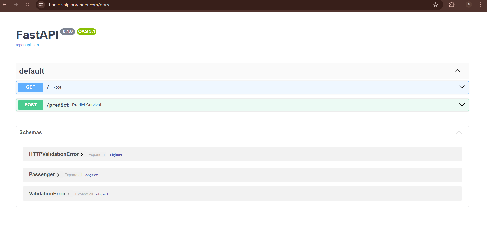
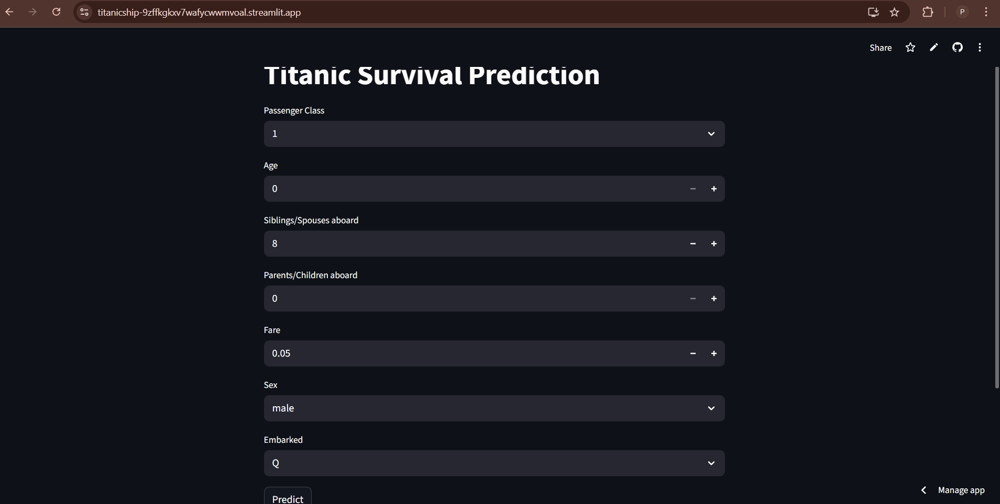

<h1> 🚢 Titanic Survival Prediction</h1>

This project predicts whether a passenger survived the Titanic disaster or not using **Logistic Regression**.  
It is deployed with:  
- **Backend (FastAPI)** → [titanic-ship.onrender.com](https://titanic-ship.onrender.com)  
- **Frontend (Streamlit)** → [titanicship-9zffkgkxv7wafycwwmvoal.streamlit.app](https://titanicship-9zffkgkxv7wafycwwmvoal.streamlit.app)

---

## 📌 Features
- Logistic Regression model trained on Titanic dataset  
- REST API built with **FastAPI**  
- Interactive UI built with **Streamlit**  
- Backend and Frontend are deployed separately  

---

## 🗂️ Project Structure

```text
Titanic_ship/
├── backend/
│   ├── main.py             # FastAPI app (API endpoints)
│   ├── requirements.txt    # Dependencies for backend
│   ├── start.sh            # Startup script
│   ├── titanic_model.pkl   # Trained Logistic Regression model
│   └── train.py            # Model training script
├── frontend/
│   ├── index.py            # Streamlit app
│   └── requirements.txt    # Dependencies for frontend
└── .devcontainer/
    └── devcontainer.json   # Development container configuration

```

<h3>⚙️ Installation & Setup (Local)</h3>

1️⃣ Clone the repository
bash
Copy code
git clone https://github.com/your-username/Titanic_ship.git
cd Titanic_ship

2️⃣ Setup Backend (FastAPI)
bash
Copy code
cd backend
pip install -r requirements.txt
uvicorn main:app --reload --host 0.0.0.0 --port 8081
Backend will be live at:
👉 http://127.0.0.1:8081 (locally)
👉 /docs for Swagger UI

3️⃣ Setup Frontend (Streamlit)

bash
Copy code
cd ../frontend
pip install -r requirements.txt
streamlit run index.py
Frontend will be live at:
👉 http://localhost:8501

📡 API Endpoints
Base URL (Render): https://titanic-ship.onrender.com

GET / → Root endpoint

POST /predict → Predict survival

Example Request
json
Copy code
{
  "Pclass": 3,
  "Age": 22,
  "SibSp": 1,
  "Parch": 0,
  "Fare": 7.25,
  "Sex": "male",
  "Embarked": "S"
}
Example Response
json
Copy code
{
  "survived": 0,
  "probability": 0.18
}

<h4>🎨 Frontend (Streamlit)</h4>
The Streamlit UI allows users to:

Select passenger class, age, sex, and other features

Get prediction on whether the passenger survived

<h4>Deployed app: Streamlit Titanic App</h4>

<h3>📊 Screenshots</h3>
<p align="center">   </p>
🚀 Deployment

Backend → Hosted on Render (uvicorn main:app --host 0.0.0.0 --port 8081)

Frontend → Hosted on Streamlit Cloud

<h3>📊 Model</h3>

Algorithm: Logistic Regression

Trained on Titanic dataset (Kaggle)

Features: Passenger Class, Age, SibSp, Parch, Fare, Sex, Embarked


